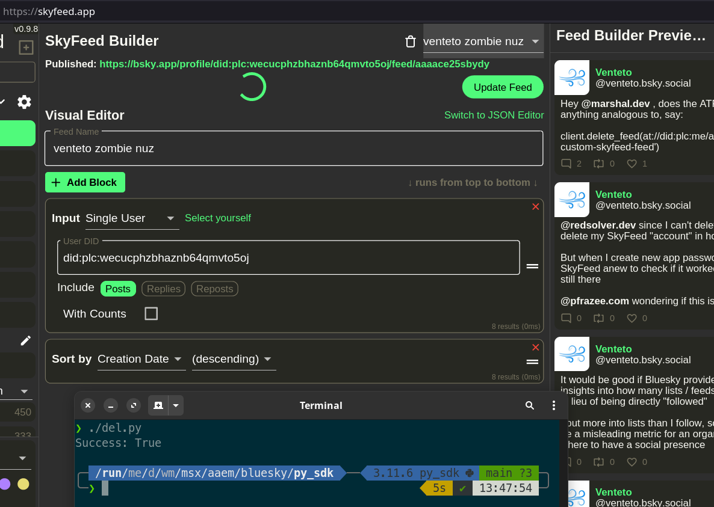
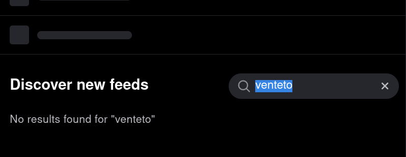

# ATProto Python SDK Feed Deletion
Attempting to delete a custom feed created with SkyFeed, because in the SkyFeed this feed never gets completely deleted. In contrast, in the SkyFeed UI I *was* able to delete *other* custom feeds without leaving any lingering unpublished "record'".

Not quite sure if I have done everything correctly in [del.py](del.py).

## Initial script output
(click the images to view them directly)

Success is indicated in the terminal, but in the SkyFeed UI the feed is still present *and* published, although some quasi activity spinner circles infinitely:

In contrast, from the point of view of the *Bluesky app* itself, the zombie feed at least appears *unpublished*, if not deleted completely:
